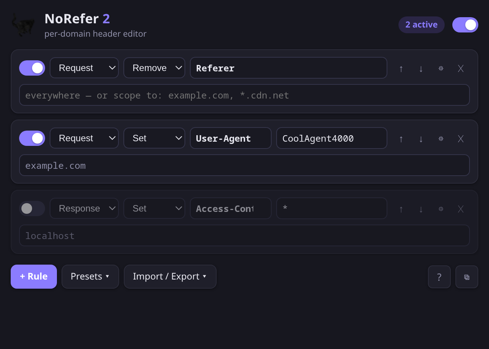

# NoRefer 2

Per-domain HTTP header editor for Chrome and Firefox. Set, append, or strip
any **request or response** header, scoped to the sites you choose — the
modern successor to [NoRefer](https://github.com/c475/NoRefer).



## Features

- **Per-domain rules** — scope each rule to one or more domains
  (subdomains included automatically), or leave it global. Advanced scoping
  lets a rule match by *target host* (the server being contacted), by
  *page host* (the site the request originates from), or by a
  [URL filter](https://developer.mozilla.org/docs/Mozilla/Add-ons/WebExtensions/API/declarativeNetRequest#url_filter_syntax)
  like `||example.com/api/*`.
- **Request *and* response headers** — strip `Referer` on the way out, or
  drop `Content-Security-Policy` / set `Access-Control-Allow-Origin` on the
  way in (handy for local development).
- **Set / Remove / Append** operations per rule.
- **Priority by order** — when two rules touch the same header, the rule
  higher in the list wins. Reorder with ↑ ↓.
- **Per-tab badge** showing how many rules apply on the current site, plus a
  master kill-switch.
- **Presets** for common setups (strip Referer, DNT + Sec-GPC, UA spoof,
  CSP drop, CORS unlock). The sharp-edged ones arrive disabled so you scope
  them before switching them on.
- **JSON import/export**, and an importer for NoRefer v1 textarea configs.
- **Native-speed, private** — headers are rewritten by the browser's
  `declarativeNetRequest` engine (no extension code on the request path),
  and everything is stored locally. No telemetry, no servers.

## Install

Not on the stores (yet) — load it from source:

**Chrome / Chromium / Edge**
1. `chrome://extensions` → enable *Developer mode*
2. *Load unpacked* → select this repo's directory

**Firefox** (121+)
1. `about:debugging#/runtime/this-firefox`
2. *Load Temporary Add-on…* → select `manifest.json`

For permanent Firefox installs the zip from `./package.sh` needs to be
signed (AMO or self-distributed signing).

Both browsers run the **same code**: Chrome uses
`background.service_worker`, Firefox uses `background.scripts`, and each
ignores the other's manifest key. Everything else is shared MV3 API.

## Migrating from NoRefer v1

*Import / Export → Import NoRefer v1 config* and paste your old textarea.
`Header` lines become remove-rules, `Header: value` lines become set-rules.

One capability did not survive the move off the deprecated blocking
`webRequest` API: regex **header names** (`#Accept.*`). The
`declarativeNetRequest` engine matches header names literally, so those
lines are reported instead of imported. URL filters cover part of the gap
from the other direction.

## Notes & limits

- `Append` on request headers is only honored by browsers for a small set
  (`Accept`, `Accept-Language`, `Cache-Control`, `Cookie`, …). Response
  headers can generally be appended freely.
- Some headers are browser-reserved (e.g. `Host`) and can't be edited; if
  the browser rejects a rule set, the popup shows the error in a toast.
- Rules apply to all resource types both browsers support, including
  main-frame navigations, XHR/fetch, and websockets.

## Development

No build step — plain MV3 JavaScript.

```
node --test test/rules.test.cjs     # rule-engine unit tests
npx web-ext lint --source-dir .     # Firefox validation
./package.sh                        # store zips for both browsers in dist/
```

The rule engine (`rules.js`) is shared by the popup, the background
worker, and the test suite. Opening `popup.html` outside an extension
context runs a demo mode with seeded rules for UI hacking.

## License

MIT
